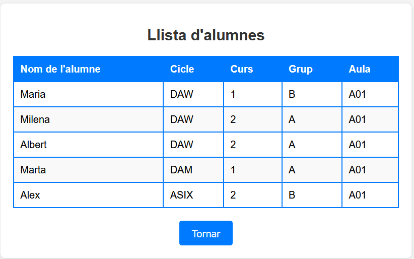
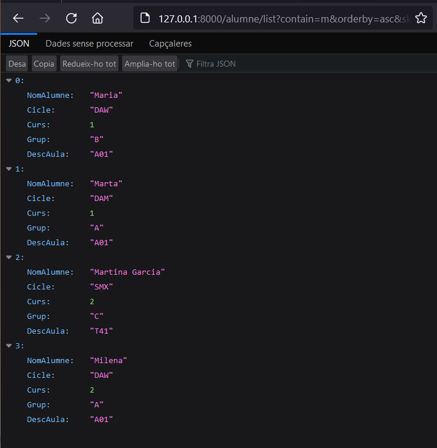

# APARTADO 1
En este apartado lo que se pide es que se muestre una tabla de los alumnos: 

## Script.js
Primero se hace con un fetch llamando al endpoint de la API. 
Después de eso tenemos que poner la iteración de cada campo que queremos pasarle para que se muestre en la tabla. 

## db_alumnes.py
Como uno de los campos que pide pertenece a la tabla de Aula y no a la misma tabla de Alumne, tenemos que hacer un join en el fichero db_alumnes.py en la función adecuada. 

## alumnes.py
Además tenemos que cambiar los campos que le pasamos en la función del alumno para que nos coja los 5 campos que necesitamos. 

## main.py
En este fichero se tiene que añadir un import que sirve para que el frontend que tiene un codigo de Javascript se pueda comunicar con el backend. Además tenemos que añadir unas lineas que pertenecen a ese import para que pueda ejecutarse bien. Creamos una clase Base que contenga los campos que devuelve el select de la tabla de alumnos. Después de añadir los campos necesarios y hacer los cambios necesarios ejecutamos el archivo de index.html y nos tiene que salir la tabla completa (teniendo en cuenta que no salen los nuevos alumnos del apartado 3):

### Con los alumnos añadidos del apartado 3

# APARTADO 2
## PRIMERA CONSULTA
En este apartado se pide hacer 4 consultas. En las 4 consultas tenemos que modificar 2 archivos: db_alumnes.py y main.py. La primera consulta  pide que se haga un orderby asc o desc, además de que devuelva el nombre del alumno, el ciclo, el curso, el grupo y la descripción del aula en una lista json. Tenemos que modificar los mismos 2 archivos:

### db_alumnes.py
Tenemos que añadir 2 condiciones que sea asc o desc y poner que lo ordene dependiendo como se lo hemos indicado. 

### main.py
En este archivo tenemos que añadir una función que como parámetros le pasemos: orderby: Optional[str] = None, esto significa que el orderby puede ser string o none. Además el = None significa que por defecto no hay nada.

### Orderby

## SEGUNDA CONSULTA
La siguiente consulta sirve para saber si el campo del nombre del alumno que está dentro de la base de datos y se visualiza en la lista json contiene ese nombre. Tiene que devolver los mismos campos que en la consulta anterior, es decir, el nombre del alumno, el ciclo, el curso, el grupo y la descripción del aula.
Para ello tenemos que modificar los mismos 2 archivo:

### db_alumnes.py
En este fichero añadimos otra condición que sea para ver si contiene esa palabra el nombre del alumno. Además de añadir una lista vacia para almacenar los valores junto a una condición que verifique que no sea None, si la variable contain tiene un valor agrega ese valor a la lista de antes, y ponemos % % alrededor de la variable contain para que filtre si existe ese nombre, por ejemplo, al poner Al, pues que muestre Albert,y Alex, ya que contienen 'Al'.

### main.py
En el main lo que tenemos que añadir como parámetro en la función es: contain: Optional[str] = None, que significa lo mismo que el orderby. 
Basicamente que puede contener un string o None. Luego tenemos que añadir una condición que almacena los alumnos que cumplen el criterio en una variable. Después la subcadena contain la convertimos a minúsculas. Luego, cada alumno recorre alumnes_list con un bucle for y lo pasamos a minúsculas. Si la subcadena contain_lower está en el nombre del alumno, se añade el alumno a la lista creada anteriormente. Cuando sale del bucle, la alumnes_list se reemplaza por la lista nueva.

### Contain

## TERCERA CONSULTA
En esta consulta tenemos que limitar el número de alumnos mostrados y también que se salte los alumnos dependiendo del número que le pasemos, siempre saltará empezando por arriba, por ejemplo, si queremos que se salte 2 alumnos se saltará los 2 primeros. Mostrando como en las demás consultas, los mismos 5 campos (Nombre del alumno, ciclo, curso, grupo y la descripción del aula).
Para ello tenemos que modificar los mismos 2 archivo:

### db_alumnes.py
Añadimos 2 condiciones por cada consulta, la primera condición será para el limit. Si el limit tiene valor, se añadirá a la lista de la anterior consulta. La segunda condición es para el skip, y en la condición tenemos que añadir que no supere el valor número 100 y que tampoco sea menor a 0 para añadirlo a la misma lista.

### main.py
En la función, junto a los demás parámetros tenemos que añadir: skip: int = Query(0, ge=0), limit: Optional[int] = Query (100, gt=0), la primera parte del skip, ponemos int porque los elementos que le pasaremos serán enteros. El primero 0 del Query significa que es el valor por defecto, es decir, si el cliente no envia ningún parámetro al skip, se establecerá automáticamente el 0. Y el ge=0 significa que sea mayor a 0 o igual. Si llegamos a poner 100 significaria que lo mínimo puede ser 100, por lo tanto no seria lo que buscamos.
En el caso del limit es parecido, el Query(100) signfica que si no le pasamos ningún valor, por defecto, mostrará los primeros 100 elementos, en mi caso, solo hay 8 alumnos, asi que mostrará todos los alumnos. Y el gt=0 es lo mismo que el ge=0, significa que sea mayor de 0.

### Skip Y Limit

### Todo junto:
A continuación probé de hacer todas las consultas juntas (orderby = asc, contain= m, skip = 0 y limit = 5):

# APARTADO 3
En este apartado nos dan un archivo csv, y tenemos que pasarlo a un objeto json y que se añadan todos los alumnos y aulas que no tengamos ya en nuestra base de datos. Para ello tenemos que hacer lo siguiente:

### db_alumnes.py
En este fichero tenemos que crear 2 nuevas funciones, la primera que crearemos será para insertar el aula si no está creada. Para ello tenemos que crear 2 querys pasandole el DescAula. El primer query es el que muestra la aula si ya existe el DescAula. Pero si no existe, pasamos al query nuevo que inserta otra aula en la tabla correspondiente dependiendo de su DescAula.A continuación hacemos otra función para los alumnos siguiendo la misma lógica pero en vez de crear el alumno según el DescAula, se creará dependiendo de todos los campos.

### main.py
En este fichero se tiene crear una nueva petición que sea para que muestre el archivo csv que se le ha pasado. Dentro de esta petición creamos una función para pasar archivos. Dentro de la función añadimos una condición para saber si es un archivo csv, si no lo es saldrá un mensaje que solo acepta archivos csv. Si el archivo tiene la extensión que se pide leerá el archivo y se pasará a json. Se crea un bucle for que lee cada fila del archivo transformado en json y extrae los 5 campos que se pide. Además hay que llamar a las 2 funciones creadas en db_alumnes.py para que funcione bien la petición del main. Por último hacemos un return de los resultados. Así es como nos crea los alumnos y aulas si no existen y nos lo muestra.

## CSV

Al hacer un insert así es como quedan las tablas:

