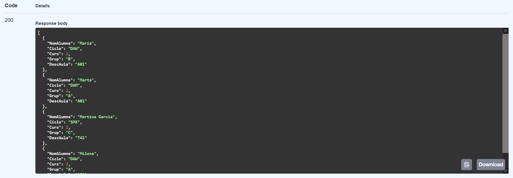

# APARTAT 1
# En este apartado lo que se pide es que se muestre una tabla de los 
# alumnos: 

# FICHERO SCRIPT.JS:
# Primero se hace con un fetch llamando al endpoint de la API. 
# Después de eso tenemos que poner la iteración de cada campo que 
# queremos pasarle para que se muestre en la tabla. 

# FICHERO DB_ALUMNES.PY
# Como uno de los campos que pide pertenece a la tabla de Aula y no a la 
# misma tabla de Alumne, tenemos que hacer un join en el fichero 
# db_alumnes.py en la función adecuada. 

# FICHERO ALUMNES.PY
# Además tenemos que cambiar los campos que le pasamos en la función del 
# alumno para que nos coja los 5 campos que necesitamos. 

# FICHERO MAIN.PY
# En este fichero se tiene que añadir un import que sirve para que el 
# frontend que tiene un codigo de Javascript se pueda comunicar con el 
# backend. Además tenemos que añadir unas lineas que pertenecen a ese 
# import para que pueda ejecutarse bien. Creamos una clase Base que 
# contenga los campos que devuelve el select de la tabla de alumnos. 
# Después de añadir los campos necesarios y hacer los cambios necesarios 
# ejecutamos el archivo de index.html y nos tiene que salir la tabla 
# completa (teniendo en cuenta que no salen los nuevos alumnos del 
# apartado 3):

# 
# Con los alumnos añadidos del apartado 3:
# 

# APARTAT 2
# En este apartado se pide hacer 4 consultas. En las 4 consultas tenemos que modificar 2 archivos: db_alumnes.py y main.py. La primera consulta pide que se haga un orderby asc o desc, además de que devuelva el nombre del alumno, el ciclo, el curso, el grupo y la descripción del aula en una lista json.
# Modificaciones en los 2 archivos:

# FICHERO DB_ALUMNES.PY:
# Tenemos que añadir 2 condiciones que sea asc o desc y poner que lo ordene dependiendo como se lo hemos indicado. 

# FICHERO MAIN.PY:
# En este archivo tenemos que añadir una función que como parámetros le pasemos: orderby: Optional[str] = None, esto significa que el orderby puede ser string o none. Además el = None significa que por defecto no hay nada.

# orderby
# 
# 

# La siguiente consulta sirve para saber si el campo del nombre del alumno que está dentro de la base de datos y se visualiza en la lista json contiene ese nombre. Tiene que devolver los mismos campos que en la consulta anterior, es decir, el nombre del alumno, el ciclo, el curso, el grupo y la descripción del aula.
# Para ello tenemos que modificar los mismos 2 archivo:

# FICHERO DB_ALUMNES.PY:
# En este fichero añadimos otra condición que sea para ver si contiene esa palabra el nombre del alumno. 

# FICHERO MAIN.PY:
# En este fichero tenemos que añadir una condición que almacena los alumnos que cumplen el criterio en una variable. Después la subcadena contain la convertimos a minúsculas. Luego, cada alumno recorre alumnes_list con un bucle for y lo pasamos a minúsculas. Si la subcadena contain_lower está en el nombre del alumno, se añade el alumno a la lista creada anteriormente. Cuando sale del bucle, la alumnes_list se reemplaza por la lista nueva.

# contain
# 
# 
# 
# 

# skip i limit
# 
# 

# Tot junt
# amb orderby = asc, skip = 0 y limit = 5:
# 
# 

# Apartat 3
# 
# 
# Les taules canvien:
# 
# 
